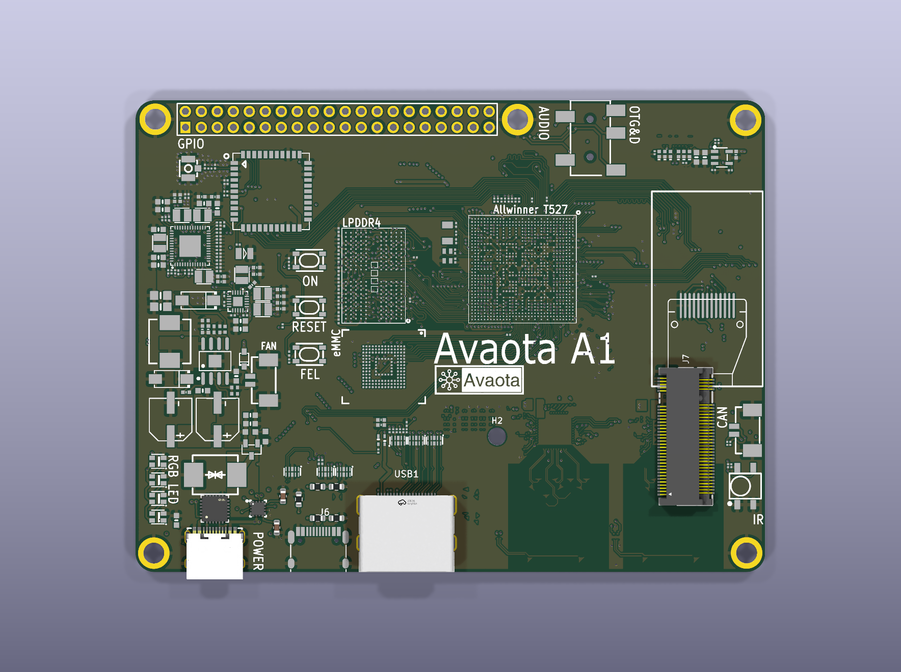
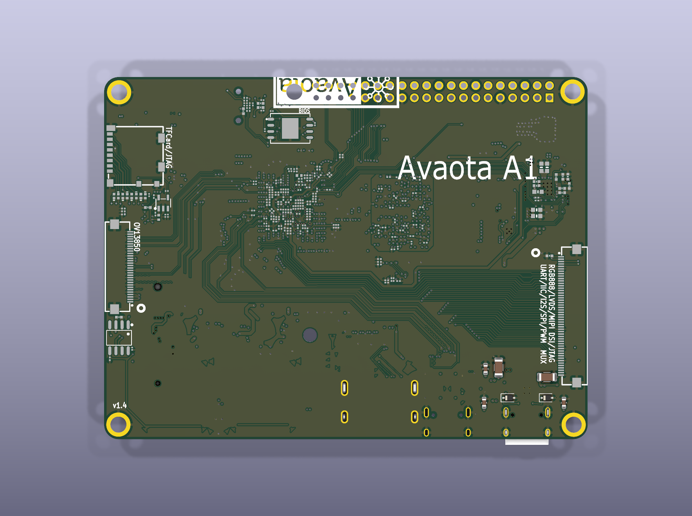
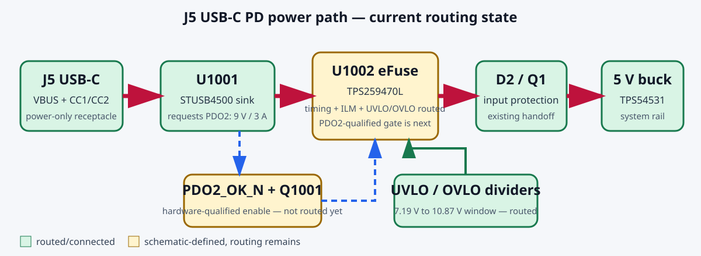

# Avaota A1-derived Android box PCB

This directory is the Rev-P1 engineering baseline for a compact T527/A527 Android
board derived from the open-hardware Avaota A1. The requested external arrangement is
now fixed at the concept level and deliberately follows the reference connector edge:

- original DC barrel location: USB-C PD power input;
- original dual USB-A location: one USB 2.0 USB-C host port;
- same connector edge: horizontal right-angle HDMI Type-A;
- all other external connectors are removed from the production baseline.

This is **not fabrication-ready**, but it is now a real editable KiCad project. The
pinned Avaota v1.4 EasyEDA source has been converted into a 15-page schematic and a
routed eight-layer PCB. The PCB now contains the first same-edge placement pass: J5
USB-C power and J6 USB-C host replace the barrel, dual USB-A and opposite-edge USB-C,
and the imported vertical HDMI footprint has been replaced by the selected HCTL
`HDMI-01` / JLCPCB `C2906135` horizontal right-angle Type-A receptacle. Both USB-C receptacle
origins are aligned 3.9055 mm inboard of the bottom board edge, matching the insertion
depth of the original USB3 receptacle; their modeled shell fronts overhang the edge by
1.267 mm. The J5 PD/protection circuit is implemented as a dedicated schematic sheet.
The PCB now uses the exact C720629 J5 footprint, places U1001/U1002 in the original
power corridor, and routes CC1/CC2, connector TVS protection, raw VBUS, the protected
9 V path, and the D2/Q1 handoff. The remaining eFuse/control passives and programming
pads are being routed incrementally: C1006, C1007 and R1012 now complete the U1002
dV/dt, timer and nominal 3.33 A current-limit programming. R1008-R1011 now route the
approximately 7.19 V UVLO and 10.87 V OVLO window. The PDO2-qualified Q1001 gate and
U1001 support network remain schematic-only. J6 still needs
its USB host power/CC circuit. Both Ethernet PHY component groups have now been removed from the
PCB and the resulting area contains a staged M-key M.2 2230 NVMe connector and
mounting hole. The external U15 eDP/DisplayPort panel connector, its protection and
coupling parts, and its dedicated PCB routing have also been removed; HDMI is retained.
The HDMI pad row retains the original 19 signal-net assignments. Its four TMDS pairs
are now locally rejoined to the preserved Avaota corridor, with CEC, DDC, HPD and +5 V
also connected. The local fanout uses the imported 0.102 mm geometry and is pair-matched,
but it is provisional until those dimensions are recalculated against the ordered
JLCPCB stack-up. The PCIe
clock, control, 3.3 V power and differential routing are not implemented yet.
The conversion findings must also be cleared before release. See
[`conversion-audit.md`](conversion-audit.md) and
[`jlcpcb-release-plan.md`](jlcpcb-release-plan.md).

## Rev-P1 baseline

| Item | Baseline | Release decision |
|---|---|---|
| SoC | Allwinner T527/A527, BGA664 | Preserve the Avaota A1 symbol, escape, clocks, straps and decoupling |
| RAM | 2 GB LPDDR4 baseline | Select an exact reference-supported MPN before schematic freeze; 4 GB is an assembly option only after boot validation |
| Storage | 32 or 64 GB eMMC 5.1, 8-bit HS400 | Select exact MPN and bootloader timing profile before release |
| Expansion storage | M-key M.2 2230 NVMe over the T527 PCIe 2.1/USB3 combo PHY | J7/H2 placement and pad nets staged; complete the schematic, 3.3 V supply, clock/control routing and PCIe SI review |
| Main PMIC | AXP717 | Reuse the Avaota A1 core power sheet and sequencing |
| CPU PMIC | AXP323 | Reuse the Avaota A1 core power sheet and sequencing |
| Video | HCTL HDMI-01 / JLCPCB C2906135, horizontal right-angle HDMI Type-A | Exact footprint and 3D model placed; TMDS/DDC/CEC/HPD/+5 V locally routed; verify enclosure and solve 100-ohm geometry against the released stack-up |
| Power | XUNPU C720629 + STUSB4500QTR C2678061 + TPS259470LRPWR C3662793 | 9 V / 3 A PDO2 into the existing protected input; default 5 V and inputs above about 10.9 V are hardware-blocked; program/verify U1001 NVM before assembly release |
| Accessory port | One USB 2.0 host USB-C replacing the dual USB-A | Reuse one existing host pair; add Rp, ESD and a current-limited VBUS switch |
| Debug | UART, JTAG, FEL and reset | Retain accessible pads or headers on prototypes |
| Excluded | Ethernet, Wi-Fi, SD, camera, audio and panel display | Ethernet and external eDP PCB circuits removed; prune other unused circuits one subsystem at a time |

## Important software consequence

The retail G'AIM'E image expects AXP2202/AXP1530. This board instead keeps the
Avaota A1's AXP717/AXP323 topology, so the stock image is **not expected to boot
unchanged**. The practical sequence is to boot an Avaota-supported Android/Linux image
first, then port the G'AIM'E bootloader/device-tree power configuration and Android
userspace. This is lower hardware risk than redesigning undocumented PMIC circuits.

## Current board views

The routing-state logical view is tracked separately so physical layout changes do not
hide unfinished control logic:

## Project files

- [`android-box-rebuild.kicad_pro`](android-box-rebuild.kicad_pro) - open this file in KiCad to load the Rev-P1 project.
- [`android-box-rebuild.kicad_sch`](android-box-rebuild.kicad_sch) - imported full Avaota schematic hierarchy.
- [`USB_C_PD_9V.kicad_sch`](USB_C_PD_9V.kicad_sch) - J5, STUSB4500 and TPS259470L protected 9 V input circuit.
- [`android-box-rebuild.kicad_pcb`](android-box-rebuild.kicad_pcb) - routed eight-layer Avaota PCB with the Rev-P1 connector placement staged; not the final routed layout.
- [`scripts/stage_same_edge_connectors.py`](scripts/stage_same_edge_connectors.py) - reproducible KiCad Python transformation used for the connector placement pass.
- [`scripts/align_usbc_to_edge.py`](scripts/align_usbc_to_edge.py) - derives the mirrored USB-C edge datum, aligns J5/J6 and removes conflicting abandoned local copper.
- [`scripts/replace_hdmi_horizontal.py`](scripts/replace_hdmi_horizontal.py) - places the exact HCTL HDMI-01 footprint, preserves the 19 signal nets and grounded shell, and clears its local reroute corridor.
- [`scripts/route_hdmi_local.py`](scripts/route_hdmi_local.py) - reproducibly reconnects the four TMDS pairs and HDMI control/power nets to the preserved Avaota corridor.
- [`datasheets/HCTL-HDMI-01_C2906135.pdf`](datasheets/HCTL-HDMI-01_C2906135.pdf) - selected connector mechanical drawing.
- [`scripts/remove_ethernet_connectors.py`](scripts/remove_ethernet_connectors.py) - reproducible removal of RJ1/RJ2, ETH0/ETH1 silkscreen and direct jack fanout.
- [`scripts/stage_nvme_2230.py`](scripts/stage_nvme_2230.py) - reproducible GMAC PCB prune and M.2 2230 placement/net staging pass.
- [`scripts/remove_edp_interface.py`](scripts/remove_edp_interface.py) - reproducible removal of U15 and the external eDP lane/AUX/HPD circuit and routing.
- [`scripts/add_usbc_pd_power.py`](scripts/add_usbc_pd_power.py) - reproducibly generates the PD sheet, marks legacy DC1 DNP and connects the protected output through the root hierarchy.
- [`scripts/route_usbc_pd_power.py`](scripts/route_usbc_pd_power.py) - places the exact J5/PD/eFuse front end and routes the connector-critical CC and 9 V power paths.
- [`scripts/route_usbc_pd_efuse.py`](scripts/route_usbc_pd_efuse.py) - incrementally places and routes the U1002 dV/dt, timer and current-limit programming parts.
- [`scripts/route_usbc_pd_window.py`](scripts/route_usbc_pd_window.py) - places and routes the U1002 UVLO/OVLO voltage-window dividers.
- [`scripts/check_j5_local.py`](scripts/check_j5_local.py) - verifies critical J5 connectivity and 0.20 mm local copper clearance on the used outer/inner layers.
- [`renders/pcb-top.png`](renders/pcb-top.png) and [`renders/pcb-bottom.png`](renders/pcb-bottom.png) - regenerated full-board 3D views after each routed milestone.
- [`power-path.svg`](power-path.svg) - logical USB-C PD power/control state, updated when that design changes.
- [`nvme-migration.md`](nvme-migration.md) - J7 pin map, placement, sources and remaining NVMe design blockers.
- [`conversion-audit.md`](conversion-audit.md) - source provenance, import repairs, validation counts and conversion backlog.
- [`connector-migration.md`](connector-migration.md) - current connector/net mapping and the controlled same-edge conversion sequence.
- [`mechanical-datums.csv`](mechanical-datums.csv) - enclosure measurements required before connector placement is locked.
- [`jlcpcb-release-plan.md`](jlcpcb-release-plan.md) - gated plan from source import to the JLCPCB upload package.
- [`architecture.md`](architecture.md) - block-level electrical design and net contracts.
- [`power-tree.csv`](power-tree.csv) - Avaota-derived regulator map that must be checked against the editable source.
- [`interfaces.csv`](interfaces.csv) - connector and SoC interface contract.
- [`bom-seed.csv`](bom-seed.csv) - critical parts and sourcing gates.
- [`layout-rules.md`](layout-rules.md) - stack-up, placement and routing constraints.
- [`bring-up.md`](bring-up.md) - staged prototype validation.
- [`reference-design.md`](reference-design.md) - pinned Avaota A1 source and license notes.
- [`floorplan.svg`](floorplan.svg) - Rev-P1 connector and major-component placement.

## Recommended implementation path

1. Clear the import-audit items that can hide real shorts, outline defects or incorrect
   manufacturing constraints; keep a frozen hash of the original conversion.
2. Freeze measured enclosure datums for the same-edge USB-C power, USB-C host and HDMI row.
3. Remove unused external peripherals without changing core nets or power sequencing.
4. Finish the J5 eFuse/control passive fanout, adapt the single USB host protection,
   and implement the M.2 3.3 V regulator/switch plus PCIe clock and control nets on
   the schematic.
5. Select exact SoC, DRAM, eMMC and PMIC MPNs, verify the selected connector drawings,
   and agree with JLCPCB how the fine-pitch BGAs and any consigned parts will be handled.
6. Preserve the reference DRAM placement/escape and route the changed edge I/O and
   PCIe Gen2 pair around it using the released stack-up impedance geometry.
7. Complete every release gate in `jlcpcb-release-plan.md`, build a small prototype lot,
   and use the staged bring-up plan before attempting a firmware port.
